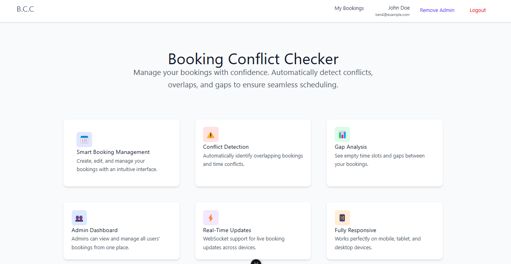
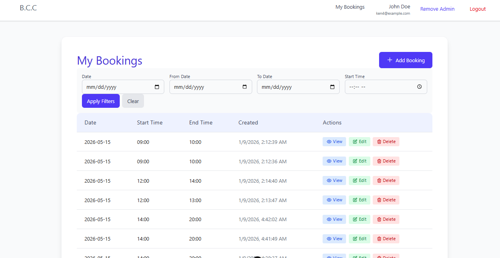
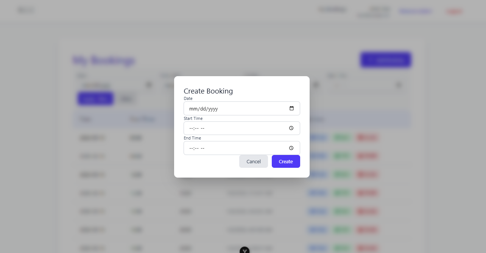
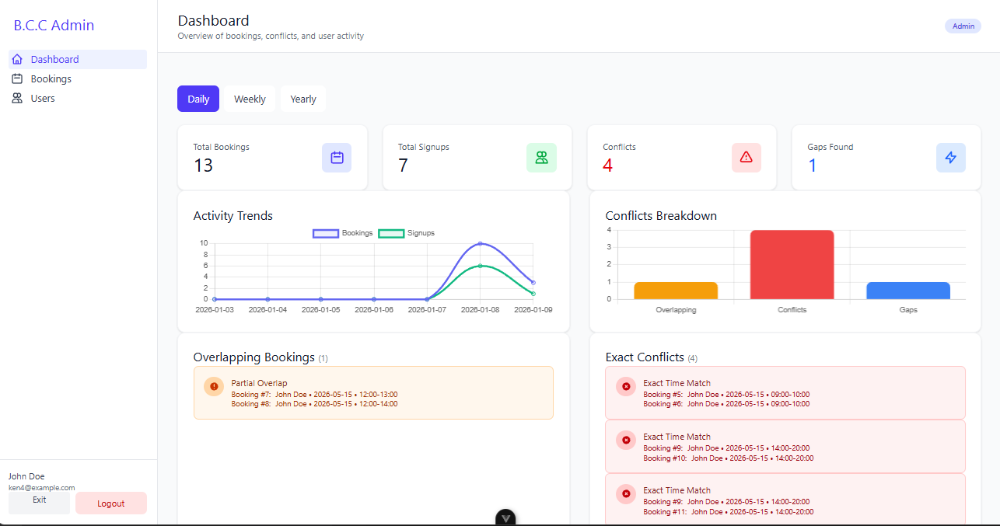
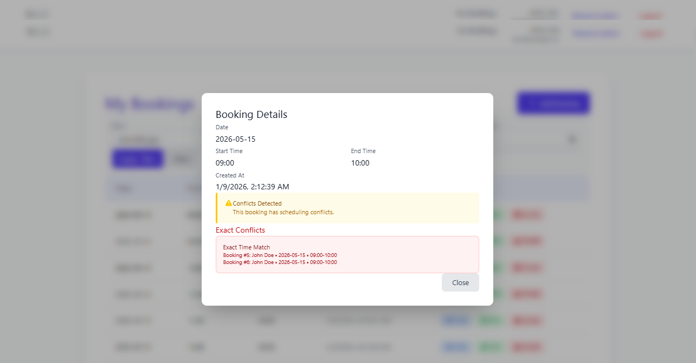
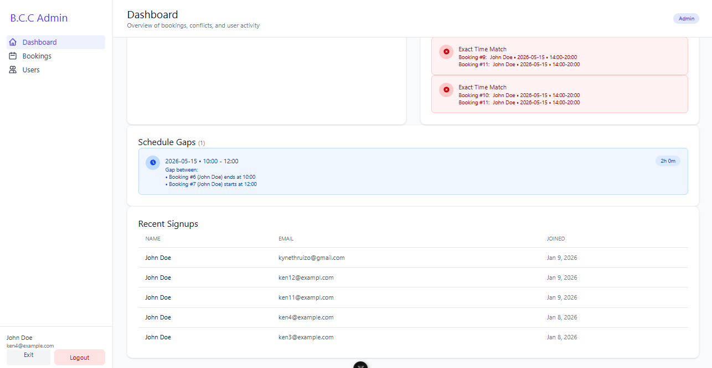
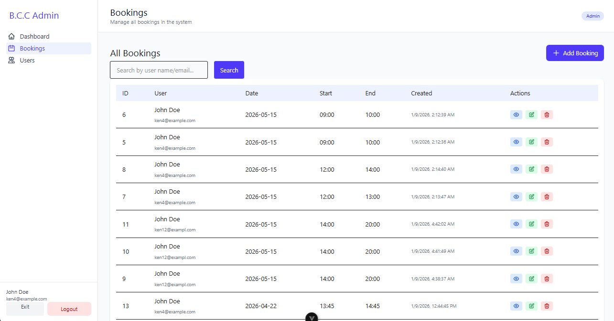
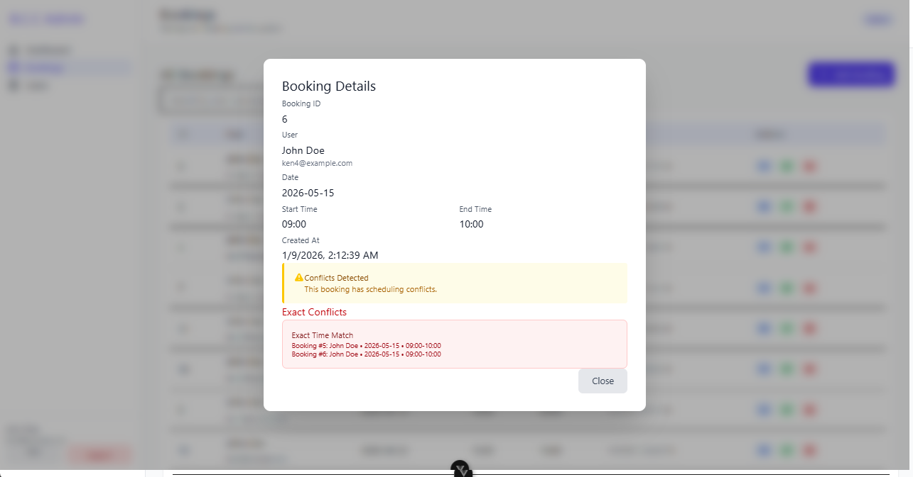

# Booking Conflict Checker

Full-stack application for managing and analyzing booking conflicts, built with Laravel 12 (backend) and Vue 3 (frontend).

## 🎯 Project Overview

This application provides a comprehensive booking management system with intelligent conflict detection, admin capabilities, and automated maintenance. It follows industry best practices and coding standards.

## Sample Pictures

<div align="center">
  
  <p><em>Main ("Become Admin" is for toggling admin permission (testing))</em></p>

  
  <p><em>Dashboard Overview</em></p>
  
  
  <p><em>Booking Form</em></p>
  
  
  <p><em>Admin Panel</em></p>
  
  
  <p><em>User Management</em></p>
</div>

**[📸 View More Screenshots](#screenshots)** _(Includes detailed views of booking calendar, conflict detection, and reports)_

## 📋 Requirements

### System Requirements

- **PHP** >= 8.2
- **Composer** >= 2.0
- **Node.js** >= 18.x
- **npm** >= 9.x (or yarn/pnpm)

### PHP Extensions

- OpenSSL
- PDO (SQLite)
- Mbstring
- Tokenizer
- XML
- Ctype
- JSON
- BCMath
- ZIP

## ✨ Features Implemented

### Backend (Laravel 12)

- ✅ **Sanctum Authentication (Hybrid Mode)** - Cookie-based sessions for web SPA + Bearer tokens for mobile apps
- ✅ **CSRF Protection** - Automatic CSRF validation for cookie-based requests, bypassed for token auth
- ✅ **RESTful API (v1)** - Complete CRUD operations with versioned endpoints
- ✅ **Conflict Detection** - Smart analysis of overlapping bookings and gaps
- ✅ **Admin System** - Role-based access with protected admin routes
- ✅ **Scheduled Jobs** - Automatic cleanup of bookings older than 30 days
- ✅ **PSR-12 Compliance** - Industry-standard PHP coding style
- ✅ **SOLID Architecture** - Proper separation of concerns with Services and Repositories
- ✅ **Validation** - Form Request validation for all inputs
- ✅ **API Resources** - Consistent JSON response formatting
- ✅ **SQLite Database** - Zero-configuration database setup
- ✅ **Pagination** - Built-in pagination with sorting and filtering

## Frontend (Vue 3)

- ✅ **Protected Routes**
- ✅ **Complete Booking Operations (CRUD) with search filters.**
- ✅ **Fully Responsive**
- ✅ **Complete Admin Operations**

## 🌟 Improvements Beyond Requirements

### 1. **Unified API Response Structure**

All API responses follow a consistent format:

```json
{
    "status": 200,
    "errorCode": null,
    "message": "Success message",
    "timestamp": "2026-01-08T18:00:00+00:00",
    "data": { ... },
    "pagination": { ... }  // Only for paginated responses
}
```

- Automatic detection of paginated vs non-paginated responses
- Standardized error codes (VALIDATION_ERROR, UNAUTHENTICATED, FORBIDDEN, etc.)
- Field-level validation errors in `errors` object

### 2. **Hybrid Authentication (Web + Mobile)**

- **Cookie Mode for Web SPA**: Secure httpOnly cookies with CSRF protection
- **Bearer Token for Mobile**: Token-based auth that bypasses CSRF
- Single endpoint returns both session cookie AND token
- Custom `VerifyCsrfForWeb` middleware intelligently handles both modes

### 3. **Advanced Pagination & Filtering**

All list endpoints support:

- `page` - Page number
- `per_page` - Items per page (max 100)
- `sort_by` - Dynamic field sorting
- `sort_direction` - asc/desc
- `keyword` - Search across multiple fields
- `date`, `date_from`, `date_to` - Date range filtering
- Uses Laravel's `withQueryString()` for proper pagination links

### 4. **Admin Statistics Dashboard**

- Daily/Weekly/Monthly booking trends
- User signup analytics
- Recent signups list
- Summary statistics

### 5. **Artisan Command for Manual Cleanup**

```bash
php artisan bookings:delete-old
```

Run cleanup manually in addition to scheduled job.

### 6. **Self-Toggle Admin Permission (Testing)**

```
PATCH /api/v1/user/{id}/permission
```

Allows toggling admin status for testing purposes (with self-demotion protection).

### 7. **Soft Deletes Ready**

Database structure supports soft deletes for data recovery.

### 8. **Health Check Endpoint**

```
GET /api/v1/health
```

For monitoring and load balancer health checks.

### 9. **Comprehensive Test Suite**

Full PHPUnit test coverage including:

- **Feature Tests**: AuthController, BookingController, UserController
- **Unit Tests**: ConflictCheckService
- 70+ test cases covering authentication, CRUD, authorization, pagination, and conflict detection

```bash
# Run all tests
php artisan test

# Run with coverage
php artisan test --coverage
```

### 10. **Docker & Nginx Production Setup**

Complete containerization with:

- Multi-stage Dockerfile for optimized builds
- Nginx reverse proxy with rate limiting
- Docker Compose for orchestration
- Separate scheduler and queue worker containers
- Health checks on all services

### 11. **Rich Dashboard**

Provides rich overview and statistics about bookings including:

- Conflicts
- Gaps
- Recent Signups
- Overlaps

### 12. **Fully Responsive Frontend**

UI adjusts based on different screen dimensions.

## 🏗️ Architecture Highlights

**Following Company Coding Standards:**

1. **PSR-12 Coding Standards** ✅

   - Proper indentation, spacing, and formatting
   - Consistent naming conventions
   - Type hints and return types

2. **SOLID Principles** ✅

   - Single Responsibility: Each class has one purpose
   - Dependency Inversion: Services injected via constructor
   - Open/Closed: Extensible design

3. **Clean Architecture** ✅
   - **Thin Controllers**: Only HTTP concerns
   - **Service Classes**: All business logic (AuthService, BookingService, ConflictCheckService, UserService, StatisticsService)
   - **Repository Classes**: All database operations (BookingRepository, UserRepository)
   - **Form Requests**: Input validation (RegisterRequest, LoginRequest, StoreBookingRequest, UpdateBookingRequest, UpdateUserRequest)
   - **API Resources**: Response formatting (BookingResource, UserResource, AuthResource)
   - **Custom Middleware**: VerifyCsrfForWeb, AdminMiddleware

## 📁 Project Structure

```
booking-checker/
├── backend/                 # Laravel 12 API
│   ├── app/
│   │   ├── Console/Commands/       # Artisan commands (DeleteOldBookingsCommand)
│   │   ├── Enums/                  # ErrorCode enum
│   │   ├── Http/
│   │   │   ├── Controllers/        # Thin controllers
│   │   │   ├── Middleware/         # Admin, CSRF middleware
│   │   │   ├── Requests/           # Form validation
│   │   │   ├── Resources/          # API responses (AuthResource, UserResource, BookingResource)
│   │   │   └── Responses/          # ApiResponse helper
│   │   ├── Jobs/                   # Scheduled jobs
│   │   ├── Models/                 # Eloquent models
│   │   ├── Repositories/           # Database operations
│   │   └── Services/               # Business logic
│   ├── config/                     # Configuration files
│   ├── database/
│   │   ├── factories/              # Model factories (UserFactory, BookingFactory)
│   │   └── migrations/             # Database schema
│   ├── docker/                     # Docker configuration
│   │   ├── entrypoint.sh           # Container startup script
│   │   ├── nginx.conf              # Nginx main config
│   │   └── locations.conf          # Nginx location blocks
│   ├── tests/
│   │   ├── Feature/                # Feature tests (API endpoints)
│   │   └── Unit/                   # Unit tests (Services)
│   └── routes/
│       └── api.php                 # API routes (v1)
│
├── frontend/               # Vue 3 + Pinia
│   ├── src/
│   │   ├── components/     # Reusable components
│   │   ├── composables/    # Shared logic
│   │   ├── stores/         # Pinia stores
│   │   ├── views/          # Page components
│   │   └── router/         # Vue Router
│   └── SAMPLE_API_RESPONSES.md  # API documentation
│
└── docker-compose.yml      # Container orchestration
```

## 🚀 API Endpoints

### Authentication

| Method | Endpoint                       | Description                    |
| ------ | ------------------------------ | ------------------------------ |
| POST   | `/api/v1/auth/register`        | Register new user              |
| POST   | `/api/v1/auth/login`           | Login (returns cookie + token) |
| POST   | `/api/v1/logout`               | Logout user                    |
| GET    | `/api/v1/user`                 | Get authenticated user         |
| PUT    | `/api/v1/user`                 | Update own profile             |
| PATCH  | `/api/v1/user/{id}/permission` | Toggle admin status (testing)  |

### Bookings (Protected)

| Method | Endpoint                         | Description               | Query Params                                                                                                                 |
| ------ | -------------------------------- | ------------------------- | ---------------------------------------------------------------------------------------------------------------------------- |
| GET    | `/api/v1/bookings`               | List bookings (paginated) | `page`, `per_page`, `sort_by`, `sort_direction`, `date`, `date_from`, `date_to`, `start_time`, `end_time`, `keyword` (admin) |
| POST   | `/api/v1/bookings`               | Create booking            | -                                                                                                                            |
| GET    | `/api/v1/bookings/{id}`          | Get single booking        | -                                                                                                                            |
| PUT    | `/api/v1/bookings/{id}`          | Update booking            | -                                                                                                                            |
| DELETE | `/api/v1/bookings/{id}`          | Delete booking            | -                                                                                                                            |
| GET    | `/api/v1/bookings/{id}/validate` | Check for conflicts       | -                                                                                                                            |

### Admin Only (Protected + Admin Middleware)

| Method | Endpoint                              | Description                | Query Params                                               |
| ------ | ------------------------------------- | -------------------------- | ---------------------------------------------------------- |
| GET    | `/api/v1/admin/users`                 | List all users (paginated) | `page`, `per_page`, `sort_by`, `sort_direction`, `keyword` |
| GET    | `/api/v1/admin/users/{id}`            | Get user details           | -                                                          |
| PUT    | `/api/v1/admin/users/{id}`            | Update any user            | -                                                          |
| PATCH  | `/api/v1/admin/users/{id}/permission` | Toggle user admin status   | -                                                          |
| GET    | `/api/v1/admin/conflicts`             | Conflict report            | -                                                          |
| GET    | `/api/v1/admin/statistics`            | Dashboard stats            | `period` (daily/weekly/yearly)                             |

### Utility

| Method | Endpoint               | Description             |
| ------ | ---------------------- | ----------------------- |
| GET    | `/api/v1/health`       | Health check            |
| GET    | `/sanctum/csrf-cookie` | Get CSRF cookie for SPA |

## 🔧 Installation & Setup

### Backend Setup

1. **Navigate to backend directory**

   ```bash
   cd backend
   ```

2. **Install dependencies**

   ```bash
   composer install
   ```

3. **Configure environment**

   ```bash
   copy .env.example .env
   php artisan key:generate
   ```

4. **Configure Sanctum for SPA** (in `.env`)

   ```env
   SESSION_DRIVER=file
   SESSION_DOMAIN=localhost
   SESSION_COOKIE=booking_checker_session
   SANCTUM_STATEFUL_DOMAINS=localhost,localhost:5173,127.0.0.1,127.0.0.1:5173
   SESSION_SAME_SITE=lax
   ```

5. **Setup database**

   ```bash
   # Create SQLite database file
   type nul > database\database.sqlite

   # Run migrations
   php artisan migrate
   ```

6. **Start server**
   ```bash
   php artisan serve
   ```
   Backend API: `http://localhost:8000`

### Frontend Setup

1. **Navigate to frontend directory**

   ```bash
   cd frontend
   ```

2. **Install dependencies**

   ```bash
   npm install
   ```

3. **Start development server**
   ```bash
   npm run dev
   ```
   Frontend: `http://localhost:5173`

## 🐳 Docker Deployment

### Quick Start with Docker

```bash
# Build and start all services
docker-compose up -d

# View logs
docker-compose logs -f

# Stop services
docker-compose down
```

Application will be available at `http://localhost`

### Development Mode (with hot reload)

```bash
# Start with frontend dev server
docker-compose --profile dev up -d
```

### Production Mode (with scheduler & queue)

```bash
# Start all production services
docker-compose --profile production up -d
```

### Docker Services

| Service     | Description                  | Port |
| ----------- | ---------------------------- | ---- |
| `nginx`     | Reverse proxy & static files | 80   |
| `backend`   | Laravel PHP-FPM              | 9000 |
| `frontend`  | Vue dev server (dev only)    | 5173 |
| `scheduler` | Laravel cron jobs (prod)     | -    |
| `queue`     | Laravel queue worker (prod)  | -    |

### Docker Commands

```bash
# Rebuild containers
docker-compose build --no-cache

# Run migrations
docker-compose exec backend php artisan migrate

# Run tests in container
docker-compose exec backend php artisan test

# View backend logs
docker-compose logs -f backend

# Access backend shell
docker-compose exec backend sh
```

## 🧪 Running Tests

### PHPUnit Tests

```bash
cd backend

# Run all tests
php artisan test

# Run with verbose output
php artisan test --verbose

# Run specific test file
php artisan test tests/Feature/AuthControllerTest.php

# Run specific test method
php artisan test --filter test_user_can_register_with_valid_data

# Run with coverage report
php artisan test --coverage

# Run only unit tests
php artisan test --testsuite=Unit

# Run only feature tests
php artisan test --testsuite=Feature
```

### Test Structure

```
tests/
├── Feature/
│   ├── AuthControllerTest.php     # 15 tests (auth flow)
│   ├── BookingControllerTest.php  # 25 tests (CRUD, filtering)
│   └── UserControllerTest.php     # 15 tests (admin, profiles)
└── Unit/
    └── ConflictCheckServiceTest.php # 12 tests (overlap detection)
```

## 🧪 Testing the API

### Get CSRF Cookie (for web SPA)

```bash
curl -c cookies.txt http://localhost:8000/sanctum/csrf-cookie
```

### Register User

```bash
curl -X POST http://localhost:8000/api/v1/auth/register \
  -H "Content-Type: application/json" \
  -d '{"name":"John Doe","email":"john@example.com","password":"password123","password_confirmation":"password123"}'
```

### Login

```bash
curl -X POST http://localhost:8000/api/v1/auth/login \
  -H "Content-Type: application/json" \
  -d '{"email":"john@example.com","password":"password123"}'
```

### Create Booking (with token)

```bash
curl -X POST http://localhost:8000/api/v1/bookings \
  -H "Content-Type: application/json" \
  -H "Authorization: Bearer YOUR_TOKEN" \
  -d '{"date":"2026-01-15","start_time":"09:00","end_time":"10:00"}'
```

### Search Bookings (admin)

```bash
curl "http://localhost:8000/api/v1/bookings?keyword=john&date_from=2026-01-01&sort_by=date&sort_direction=desc&per_page=10" \
  -H "Authorization: Bearer ADMIN_TOKEN"
```

## ⚙️ Scheduled Tasks & Commands

### Scheduled Job (Automatic)

- Runs daily via Laravel's scheduler
- Deletes bookings older than 30 days

```bash
# Start the scheduler
php artisan schedule:work
```

### Manual Command

```bash
# Run cleanup manually
php artisan bookings:delete-old

# With custom days
php artisan bookings:delete-old --days=60
```

## 🎨 Coding Standards

### PSR-12 Compliance

- 4-space indentation
- Proper namespace declarations
- Type hints on all parameters and return types
- Consistent brace placement

### SOLID Principles Applied

1. **Single Responsibility** - Each class has one clear purpose
2. **Open/Closed** - Code is open for extension, closed for modification
3. **Liskov Substitution** - Proper use of inheritance
4. **Interface Segregation** - Focused interfaces
5. **Dependency Inversion** - Depend on abstractions, not concretions

### Laravel Best Practices

- Thin controllers with single-purpose methods
- Business logic in Service classes
- Database operations in Repository classes
- Validation in Form Request classes
- Consistent responses via API Resources
- Middleware for authorization
- Eloquent relationships properly defined

## 🔐 Security Features

- **Sanctum Hybrid Authentication** - Cookie + Token support
- **CSRF Protection** - For cookie-based requests only
- **Password Hashing** - bcrypt
- **CORS Configuration** - Configured for frontend origin
- **Admin Middleware** - Protected admin routes
- **SQL Injection Prevention** - Via Eloquent ORM
- **Input Validation** - All endpoints validated
- **Authorization Checks** - Service-level auth checks
- **Self-Demotion Protection** - Admins can't remove own admin status

## 📊 Conflict Detection

The system provides three types of conflict analysis:

1. **Overlapping Bookings** - Bookings that partially overlap in time
2. **Exact Conflicts** - Bookings with identical date/time
3. **Gaps** - Time gaps between consecutive bookings

Each analysis includes detailed information about involved bookings and users.

## 🔑 Admin Features

Admin users (`is_admin = true`) have access to:

- All bookings from all users
- User management (view, edit, toggle permissions)
- Comprehensive conflict reports
- Statistics dashboard
- Search by user name/email

Regular users can only:

- View their own bookings
- Manage their own bookings
- Check their bookings for conflicts
- Update their own profile

## 📝 Database Schema

### Users

| Column     | Type      | Description                 |
| ---------- | --------- | --------------------------- |
| id         | bigint    | Primary key                 |
| name       | string    | User's name                 |
| email      | string    | Unique email                |
| password   | string    | Hashed password             |
| is_admin   | boolean   | Admin flag (default: false) |
| created_at | timestamp | Created date                |
| updated_at | timestamp | Updated date                |

### Bookings

| Column     | Type      | Description          |
| ---------- | --------- | -------------------- |
| id         | bigint    | Primary key          |
| user_id    | bigint    | Foreign key to users |
| date       | date      | Booking date         |
| start_time | string    | Start time (HH:MM)   |
| end_time   | string    | End time (HH:MM)     |
| created_at | timestamp | Created date         |
| updated_at | timestamp | Updated date         |

**Indexes:** user_id, date

## 🛠️ Technology Stack

**Backend:**

- Laravel 12
- PHP 8.2+
- PHPUnit (Testing)
- SQLite
- Laravel Sanctum (Hybrid Auth)
- Composer

**DevOps:**

- Docker & Docker Compose
- Nginx (Reverse Proxy)
- Multi-stage builds

**Frontend:**

- Vue 3 (Composition API)
- Pinia (State Management)
- Vue Router
- Vite
- TypeScript

## 📖 Documentation

- [API Response Examples](frontend/SAMPLE_API_RESPONSES.md) - Complete API documentation with examples
- [Backend README](backend/BACKEND_README.md) - Detailed backend setup
- [PSR-12 Standards](https://www.php-fig.org/psr/psr-12/) - PHP coding standards reference

## 🎯 Project Requirements Checklist

### Backend Requirements ✅

- [x] Laravel 12 implementation
- [x] Booking API with CRUD operations
- [x] Conflict checking logic in Service class
- [x] Repository pattern for database operations
- [x] Form Requests for validation
- [x] API Resources for responses
- [x] Admin-only routes with middleware
- [x] Scheduled job for 30-day cleanup
- [x] PSR-12 coding standards
- [x] SOLID principles
- [x] Thin controllers
- [x] SQLite database

### Frontend Requirements

- [x] Vue 3 with Composition API
- [x] Pinia state management
- [x] Authentication UI
- [x] Booking CRUD interface
- [x] Conflict highlighting
- [x] Admin dashboard
- [x] Responsive design
- [x] Real-time updates (WebSockets)

### Improvements Made ⭐

- [x] Unified API response structure
- [x] Hybrid authentication (Cookie + Token)
- [x] Advanced pagination with sorting/filtering
- [x] Statistics dashboard endpoint
- [x] Manual cleanup command
- [x] Health check endpoint
- [x] Self-toggle admin permission (testing)
- [x] Comprehensive API documentation
- [x] Full PHPUnit test suite (50+ tests)
- [x] Docker & Nginx production setup
- [x] Rich Dashboard
- [x] Fully Responsive UI

## 🤝 Contributing

This project follows strict coding standards. All contributions must:

- Follow PSR-12 standards
- Apply SOLID principles
- Include proper documentation
- Pass all tests

## 📄 License

This project is open-sourced software.

---

**Status**: Backend API and Frontend Complete ✅

## Screenshots

<details>
<summary>Click to expand all screenshots</summary>

### Booking Calendar



### Conflict Detection



### Reports Dashboard



</details>
